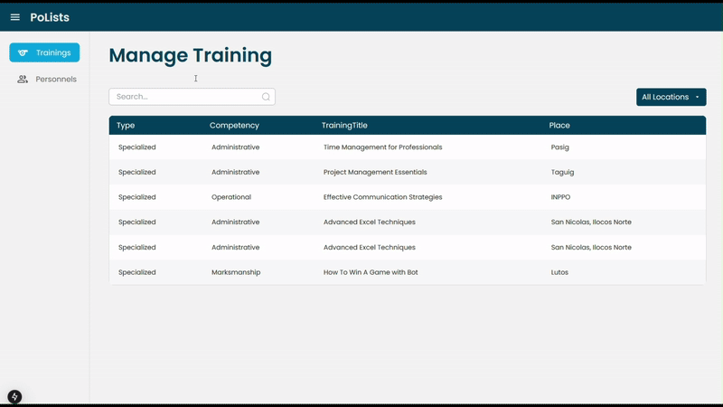

- [1. Ecoleveling Dashboard (December 2023)](#1-ecoleveling-dashboard-december-2023)
  - [Dashboard](#dashboard)
  - [Specific Room Monitoring Page](#specific-room-monitoring-page)
  - [Specific Room Monitoring Page](#specific-room-monitoring-page-1)
- [2. Dear Delicacy: Recipe Diary (October 2024)](#2-dear-delicacy-recipe-diary-october-2024)
  - [Landing Page](#landing-page)
  - [Recipe List](#recipe-list)
  - [Individual Page](#individual-page)
  - [CRUD OPERATION Page](#crud-operation-page)
- [3. LendCentral: Lending System (July-September 2023)](#3-lendcentral-lending-system-july-september-2023)
  - [Register and Login](#register-and-login)
  - [Basic Overview Page](#basic-overview-page)
  - [List View](#list-view)
  - [Individual Page](#individual-page-1)
  - [Add Item](#add-item)
  - [Return and Borrow Form](#return-and-borrow-form)
- [4. Expeso: Money Tracking (August-October 2024)](#4-expeso-money-tracking-august-october-2024)
  - [Login and Register](#login-and-register)
  - [Add Budget and Expense Page](#add-budget-and-expense-page)
  - [Filter Feature](#filter-feature)
  - [Simple Data Visualization Feature](#simple-data-visualization-feature)
- [5. Training Management System (October 2024)](#5-training-management-system-october-2024)
  - [GIF](#gif)

## [1. Ecoleveling Dashboard (December 2023)](https://github.com/JeloRisk/ecoleveling)

- Analytics part of an IoT-project
- Tech: Laravel, Vue, Tailwind, SQL

### Dashboard

- On the dashboard, you can see how data adds up over different dates. You will also find detailed logs of recent activities and information about the monitored rooms.

### Specific Room Monitoring Page

- You can see the specific room's data changes over time. You can filter and analyzer data for specific dates, whether you want to see it monthly or daily. There is a button to easily control room's light. You can turn it on or off whenever you need, whether it is automatically or manually.

### Specific Room Monitoring Page

- Activity log page makes it easy for users to filter and navigate through activities, facilitated by a user-friendly interface with pagination features.

## [2. Dear Delicacy: Recipe Diary (October 2024)](https://github.com/JeloRisk/Recipe-Management)

- Tech: MERN Stack

### Landing Page

### Recipe List

### Individual Page

### CRUD OPERATION Page

  

## [3. LendCentral: Lending System (July-September 2023)](https://github.com/JeloRisk/LendCentral)

- Tech: Laravel, Tailwind, SQL

### Register and Login

 

### Basic Overview Page

### List View

### Individual Page

### Add Item

### Return and Borrow Form

 

## [4. Expeso: Money Tracking (August-October 2024)](https://github.com/JeloRisk/Recipe-Management)

- for maintaining my finance
- Tech: Laravel, React, Chart.js

### Login and Register

 

### Add Budget and Expense Page

 

### Filter Feature

 

### Simple Data Visualization Feature

## 5. Training Management System (October 2024)

- Tech: MERN

### GIF

